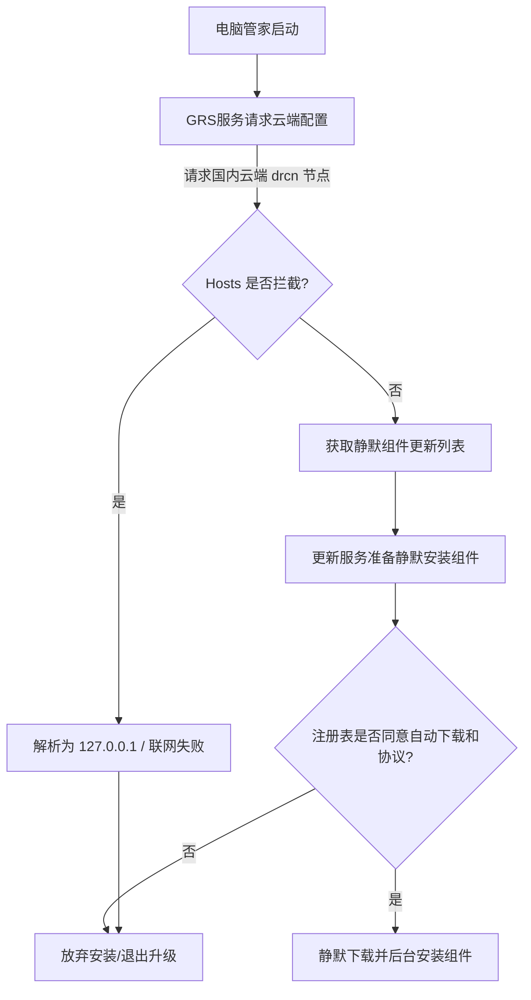

```yaml
title: "荣耀电脑管家去云控"
scripts:
  - name: disable.ps1
    desc: 禁用云控
  - name: disable_soft.ps1
    desc: 温和去云控
  - name: restore.ps1
    desc: 还原默认
```


# Fuck-HONOR-PCM

本脚本的核心作用是**在国行荣耀电脑（国内网络环境）下，完全规避荣耀电脑管家自动静默下载、安装各种推广与子组件（如 YOYO 助理、猎人营地、工作台等）的行为，对电脑管家进行本地精简和去云控净化。**

通常情况下，即使您想办法下载并安装了海外版的安装包，因为您的物理机器主板中硬编码了国行销售码（BIOS SKU），且处于国内网络下，荣耀的全球路由服务（GRS）在运行时会 100% 将您“云控强制回国”，并开始静默下载这些推广应用。本脚本从**本地注册表拦截**与**网络域名重定向**两重维度，物理切断了该下载链条。


## 将无法再安装的软件
1. YOYO 助理
2. YOYO Claw
3. 猎人营地（HUNTER CAMP）
4. 荣耀超级工作台
5. Magic 视界
   
其他：待测试

---

## 使用方法

### 图形化工具使用（推荐）
1. 下载并双击运行根目录下的 [Fuck-HONOR-PCM.exe](file://wsl.localhost/Ubuntu/home/honor/projects/Fuck-HONOR-PCM/Fuck-HONOR-PCM.exe)。
   - https://github.com/bexino/Fuck-HONOR-PCM/archive/refs/heads/main.zip
2. 在界面中根据需要选择操作：
   * **极致去云控**：完全屏蔽所有已知的云端更新及配置域名。100% 阻断后台静默推广及无本地注册表开关的子组件（如 AI 字幕、智慧音频等），但电脑管家主程序亦无法自动检测更新。
   * **温和去云控**：不封锁管家更新服务器 `configserver-drcn`。电脑管家主程序可正常自动升级，但由于云端配置通道畅通，无本地注册表开关的组件可能会在后台重新回流下载。
   * **还原默认**：清除所有 Hosts 屏蔽并清理已写入的注册表拦截策略，恢复电脑管家的出厂行为。
   

---

## 原理

荣耀电脑管家采用的是“组件化/微服务化”的更新架构。其静默下载的判定流程和本脚本的拦截原理如下：



### 原理 1：注册表断路器（针对有本地开关的组件）
当荣耀电脑管家的更新服务（`HnUpdateService`）检查到云端有新组件升级指令时，在静默下载和安装前，底层代码一定会去读取系统注册表中对应的用户配置（如 `AutoDownload`、`IdleUpgrade`、`ServicePermission` 等）。
*   若读到同意（值为 `1`）：则无感静默安装。
*   若读到拒绝（值为 `0`）或没有同意服务协议：更新模块将认定用户未授权，自动放弃并断开此组件的下载与执行。
*   **脚本操作**：预先在当前用户（HKCU）与系统全局（HKLM）中写入全部 14 个已知组件的“拒绝”键值。

### 原理 2：网络域名封锁（针对无本地开关的组件及全局云控）
对于 AI 字幕、智慧音频、Magic 文本等在本地没有留下独立注册表配置开关的组件，它们会根据云端指令直接强行执行静默升级。
*   **脚本操作**：通过修改系统的 `hosts` 文件，将荣耀的国内配置中心及应用分发域名映射到本地环回地址（`127.0.0.1`）。使其在网络层无法访问云端获取更新指令，从物理上绝育静默下载。

---

## 具体改动清单

运行此脚本后，系统将被施加以下精确改动：

### 1. 注册表级别写入清单 (HKCU & HKLM)
脚本将自动在注册表的 `HKEY_CURRENT_USER` 和 `HKEY_LOCAL_MACHINE` 的对应路径中，写入或修改以下双字节（DWORD 32位）值：

| 封锁目标组件                    | 注册表路径                                               | 写入键名                              | 写入值 (说明)                            |
| :------------------------------ | :------------------------------------------------------- | :------------------------------------ | :--------------------------------------- |
| **Magic Claw (YOYO 视界/手势)** | `\SOFTWARE\HONOR\MagicClaw\Setting`                      | `IdleUpgrade`                         | `0` (禁用空闲升级)                       |
| **YOYO 助理 (悬浮 AI 助手)**    | `\SOFTWARE\HONOR\AIAssistant\Setting\Local`              | `ServicePermission`<br>`AutoDownload` | `0` (拒绝服务协议)<br>`0` (关闭自动下载) |
| **猎人营地 (游戏管理器)**       | `\SOFTWARE\HONOR\HUNTERCAMP`                             | `ServicePermission`<br>`AutoDownload` | `0` (拒绝服务协议)<br>`0` (关闭自动下载) |
| **荣耀智慧搜索 UI**             | `\SOFTWARE\HONOR\AIAssistant\AISearch`                   | `ServicePermission`<br>`AutoDownload` | `0` (拒绝服务协议)<br>`0` (关闭自动下载) |
| **荣耀工作台 (荣耀笔记)**       | `\SOFTWARE\Microsoft\Windows\CurrentVersion\Hihonornote` | `SuitsService`<br>`AgreeSilentUpdate` | `0` (拒绝配套服务)<br>`0` (关闭静默升级) |
| **荣耀换机助手**                | `\SOFTWARE\DataMigration\HonorLoginGuide`                | `Protocol`                            | `0` (拒绝服务协议)                       |

### 2. 网络 Hosts 文件变更
脚本会在 `C:\Windows\System32\drivers\etc\hosts` 尾部追加以下条目：

*   **对于极致去云控版 (`scripts/disable.ps1`)**：
    ```text
    # [Honor PCManager Silent Update Block]
    127.0.0.1 configserver-drcn.platform.hihonorcloud.com
    127.0.0.1 logservice-drcn.dt.hihonorcloud.com
    127.0.0.1 logservice-drcn.platform.hihonorcloud.com
    127.0.0.1 appcenter-drcn.platform.hihonorcloud.com
    127.0.0.1 hnid-drcn.cloud.hihonor.com
    ```
*   **对于温和去云控版 (`scripts/disable_soft.ps1`)**（剔除了更新域名 `configserver-drcn`）：
    ```text
    # [Honor PCManager Silent Update Block]
    127.0.0.1 logservice-drcn.dt.hihonorcloud.com
    127.0.0.1 logservice-drcn.platform.hihonorcloud.com
    127.0.0.1 appcenter-drcn.platform.hihonorcloud.com
    127.0.0.1 hnid-drcn.cloud.hihonor.com
    ```
    *注：脚本会先在 `scripts` 目录下或系统同级目录下自动备份您的原始文件为 `hosts.bak`。*

### 3. 系统进程与后台服务清理
为了使上述改动免重启直接生效，脚本会强行终止以下后台进程，并刷新系统 DNS 缓存：
*   **停止进程**：`PCManager.exe`、`PCManagerTray.exe`、`HnUpdateService.exe`、`HnRSMService.exe`、`HnFrontNavigator.exe`（AI悬浮助理）、`HnMagicClawUI.exe`（手势识别）。
*   **停止系统服务**：`HnUpdateService` (荣耀更新服务)、`HnRSMService` (荣耀系统监控服务)。

---

## 其他

### 1. 对日常功能有何影响？
*   **不受影响的功能（完美保留）**：
    *   **多屏协同 / 互联互通 / 荣耀分享**：因为它们运行在本地局域网和蓝牙握手底层，不依赖国内云控服务器，因此手机连接、平板协同完全正常。
    *   **系统硬件驱动更新**：硬件驱动的检测升级基于独立的 CDN 地址及硬件比对服务，注册表组件禁用不会对其产生任何负面干扰。
*   **会被禁用的功能**：
    *   **管家主程序本身的自动升级**：
        *   运行**极致去云控版 (`scripts/disable.ps1`)**：Hosts 屏蔽将使管家无法检测到有新版本。如果您以后想要升级管家主程序，只需临时在 `hosts` 文件中删除或用 `#` 注释掉 `configserver-drcn` 条目即可。
        *   运行**温和去云控版 (`scripts/disable_soft.ps1`)**：由于未封锁 `configserver-drcn` 域名，管家主程序可直接检查并更新，无需额外配置。
    *   **荣耀账号国内登录与消息中心**：如果您在电脑端不需要登录荣耀账号或使用消息上报，该屏蔽没有任何负面体验。

### 还原
`scripts/restore.ps1` 会：  
    *   自动将 Hosts 文件从您的备份 `hosts.bak` 恢复为原始状态（若备份丢失，则自动正则删除追加的 5 个拦截域名）。  
    *   自动清理我们之前在注册表中注入的所有阻断键值（通过 `Remove-ItemProperty` 清除）。  
    *   自动重启相关常驻服务以保证默认行为立即生效。
